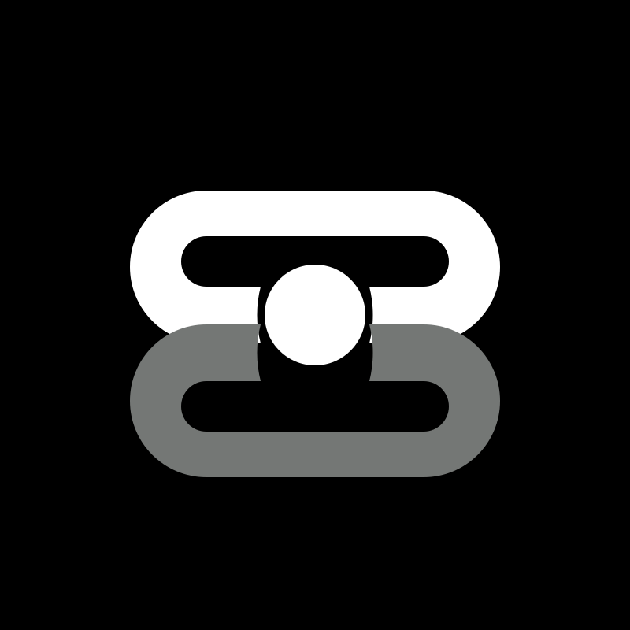

# Claude / OpenAI Chat / OpenAI Images / Codex Responses / Gemini API Proxy - CCX

English | [简体中文](README.zh-CN.md)

[](https://github.com/BenedictKing/ccx/releases/latest)
[](https://opensource.org/licenses/MIT)

CCX is a high-performance AI API proxy and protocol translation gateway for Claude, OpenAI Chat, OpenAI Images, Codex Responses, and Gemini. It provides a unified entrypoint, built-in web administration, channel orchestration, failover, multi-key management, and model routing.

## Features

- Integrated backend + frontend architecture with single-port deployment
- Dual-key authentication with `PROXY_ACCESS_KEY` and optional `ADMIN_ACCESS_KEY`
- Web admin console for channel management, testing, logs, and monitoring
- Support for Claude Messages, OpenAI Chat Completions, OpenAI Images, Codex Responses, and Gemini APIs
- Smart scheduling with priorities, promotion windows, health checks, failover, and circuit recovery
- Per-channel API key rotation, proxy support, custom headers, model allowlists, and route prefixes
- Responses session tracking for multi-turn workflows
- Embedded frontend assets for simple binary deployment

## Sponsor

<table>
<tr>
<td width="180"><a href="https://www.compshare.cn/?ytag=GPU_YY_git_ccx"></a></td>
<td>Thanks to <a href="https://www.compshare.cn/?ytag=GPU_YY_git_ccx">Youyun Zhisuan</a> for sponsoring this project! Youyun Zhisuan is UCloud's AI cloud platform, offering cost-effective domestic AI model Agent Plan packages by monthly subscription or pay-as-you-go, starting from 49 CNY/month. It also provides stable access to official overseas models, supports Claude Code, Codex, and API integrations, and offers enterprise-grade high concurrency, 24/7 technical support, and self-service invoicing. Users who register through <a href="https://www.compshare.cn/?ytag=GPU_YY_git_ccx">this link</a> can receive a free 5 CNY platform trial credit.</td>
</tr>
<tr>
<td width="180"><a href="https://runapi.co/register?aff=CqQO"></a></td>
<td>Thanks to <a href="https://runapi.co/register?aff=CqQO">RunAPI</a> for sponsoring this project! RunAPI is an efficient and stable API platform—an alternative to OpenRouter. A single API Key gives you access to 150+ leading models, including OpenAI, Claude, Gemini, DeepSeek, Grok, and more, at prices as low as 10% of the original (up to 90% off), with exceptional stability. It's seamlessly compatible with tools like Claude Code, OpenClaw, and others. RunAPI offers an exclusive perk for CCX users: register and contact an administrator to claim ¥7 in free credit.</td>
</tr>
</table>

## Screenshots

### Channel Orchestration

Visual channel management with drag-and-drop priority adjustment and real-time health monitoring.


### Add Channel

Supports multiple upstream service types and flexible API key, model mapping, and request parameter configuration.


### Traffic Stats

Real-time monitoring of per-channel request traffic, success rate, and latency.


## Architecture

CCX exposes one backend entrypoint:

```text
Client -> backend :3000 ->
  |- /                            -> Web UI
  |- /api/*                       -> Admin API
  |- /v1/messages                 -> Claude Messages proxy
  |- /v1/chat/completions         -> OpenAI Chat proxy
  |- /v1/responses                -> Codex Responses proxy
  |- /v1/images/{...}             -> OpenAI Images proxy
  |- /v1/models                   -> Models API
  `- /v1beta/models/*             -> Gemini proxy
```

Images endpoints currently include:
- `POST /v1/images/generations`
- `POST /v1/images/edits`
- `POST /v1/images/variations`

See [ARCHITECTURE.md](docs/guide/architecture.md) for the detailed design.

## Quick Start

### Option 0: CCX Desktop

CCX Desktop provides a native desktop experience with GUI for managing channels, keys, and agent configuration.

| Platform | Install Method | Notes |
|----------|---------------|-------|
| **Windows** | Search **CCX Desktop** in [Microsoft Store](https://apps.microsoft.com/detail/ccx-desktop) | Recommended. Auto-update, no manual signing. Also available as `setup.exe` from [GitHub Releases](https://github.com/BenedictKing/ccx/releases/latest). |
| **macOS** | `brew tap BenedictKing/ccx && brew install --cask ccx-desktop` | Or download `.dmg` (arm64/amd64) from [GitHub Releases](https://github.com/BenedictKing/ccx/releases/latest). |
| **Linux** | Download `.AppImage` from [GitHub Releases](https://github.com/BenedictKing/ccx/releases/latest) | Mark as executable and run. |

See [CCX Desktop Guide](docs/en/guide/desktop/) for detailed setup instructions.

### Option 1: Binary

1. Download the latest binary from [Releases](https://github.com/BenedictKing/ccx/releases/latest).
2. Create a `.env` file next to the binary:

```bash
PROXY_ACCESS_KEY=your-proxy-access-key
PORT=3688
ENABLE_WEB_UI=true
APP_UI_LANGUAGE=en
```

3. Run the binary and open `http://localhost:3000`

On Windows, if the client runs from cmd, PowerShell, WSL, or Docker and `localhost` does not reach CCX, use the Windows host IPv4 address instead, for example `http://192.168.1.23:3000`. CCX listens on all interfaces by default through `:PORT`.

For background startup without Docker, see [Service Startup](docs/service/README.md).

### Option 2: Docker

```bash
docker run -d \
  --name ccx \
  -p 3000:3000 \
  -e PROXY_ACCESS_KEY=your-proxy-access-key \
  -e APP_UI_LANGUAGE=en \
  -v $(pwd)/.config:/app/.config \
  crpi-i19l8zl0ugidq97v.cn-hangzhou.personal.cr.aliyuncs.com/bene/ccx:latest
```

Run in the background with Docker Compose:

```bash
docker compose up -d
```

Enable Watchtower auto-update:

```bash
docker compose -f docker-compose.yml -f docker-compose.watchtower.yml up -d
```

Pull the latest image immediately after setup if needed:

```bash
docker compose pull ccx
docker compose up -d ccx
```

### Option 3: Build From Source

Prerequisites: [Go 1.25+](https://go.dev/dl/), [Bun](https://bun.sh), and Make (macOS: `xcode-select --install`).

```bash
git clone https://github.com/BenedictKing/ccx
cd ccx
cp backend-go/.env.example backend-go/.env
make install   # install all dependencies (frontend + Go modules + dev tools)
make run
```

Useful commands:

```bash
make dev
make run
make build
make frontend-dev
```

## Core Environment Variables

```bash
PORT=3688
ENV=production
ENABLE_WEB_UI=true
PROXY_ACCESS_KEY=your-proxy-access-key
ADMIN_ACCESS_KEY=your-admin-secret-key
APP_UI_LANGUAGE=en
LOG_LEVEL=info
REQUEST_TIMEOUT=300000
```

## Main Endpoints

- Web UI: `GET /`
- Health: `GET /health`
- Admin API: `/api/*`
- Claude Messages: `POST /v1/messages`
- OpenAI Chat: `POST /v1/chat/completions`
- Codex Responses: `POST /v1/responses`
- OpenAI Images: `POST /v1/images/generations`, `POST /v1/images/edits`, `POST /v1/images/variations`
- Gemini: `POST /v1beta/models/{model}:generateContent`
- Models API: `GET /v1/models`

## Development

Recommended local workflow:

```bash
make dev
```

Frontend only:

```bash
cd "frontend"
bun install
bun run dev
```

Backend only:

```bash
cd "backend-go"
make dev
```

## Additional Docs

- [CCX Desktop](docs/en/guide/desktop/)
- [Client Setup](docs/en/guide/clients/)
- [CCX Desktop (中文)](docs/guide/desktop/)
- [Client Setup (中文)](docs/guide/clients/)
- [README.zh-CN.md](README.zh-CN.md)
- [backend-go/README.md](backend-go/README.md)
- [ARCHITECTURE.md](docs/guide/architecture.md)
- [DEVELOPMENT.md](docs/guide/development.md)
- [ENVIRONMENT.md](docs/guide/environment.md)
- [docs/service/README.md](docs/service/README.md) - non-Docker service startup
- [RELEASE.md](docs/guide/release.md)

## Community

Join the QQ group for discussion: **642217364**


## Star History

[](https://www.star-history.com/#BenedictKing/ccx&Date)

## License

MIT
